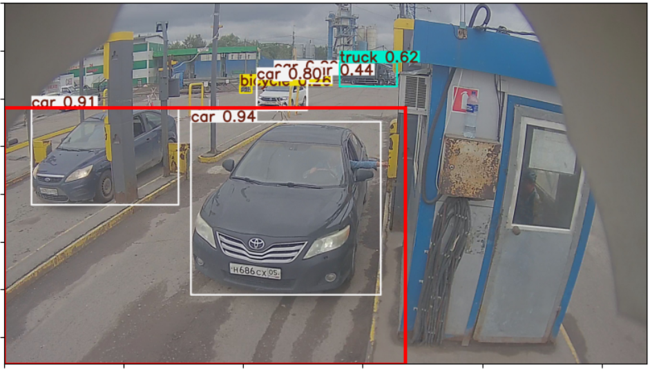
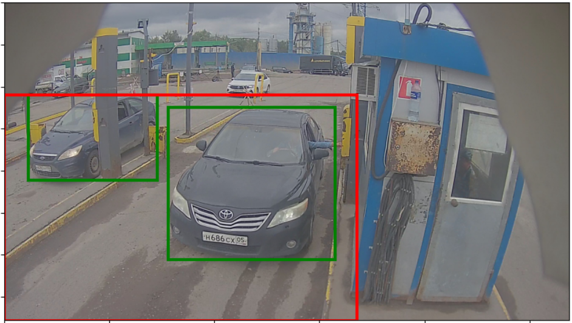
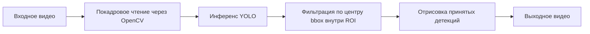

# ROI Detection Car

<p align="center">
	
	
	
	
</p>

<p align="center">
	Небольшой CV-демо-проект для детекции автомобилей внутри фиксированной зоны интереса рядом со шлагбаумом.
</p>

## Обзор

`roi_detection_car` — это компактный demo-проект, который объединяет предобученный YOLO-детектор и вручную заданную ROI-зону. Идея простая: модель ищет транспорт на каждом кадре видео, но в итоговый результат попадают только те объекты, у которых центр bounding box находится внутри нужной области перед шлагбаумом.

Такой подход полезен для сценариев с фиксированной камерой, когда интерес представляет только конкретная часть кадра, например:

- полоса перед шлагбаумом;
- зона у пункта контроля;
- участок подъезда перед точкой доступа.

Все detections вне этой зоны игнорируются, чтобы уменьшить визуальный шум и отсечь нерелевантные объекты.

## До / После ROI-фильтрации

<p align="center">
	
	
</p>

Слева показаны исходные детекции модели вместе с границей ROI.

Справа — результат после фильтрации: остаются только объекты внутри заданной области.

## Что делает проект

- Загружает предобученную YOLO-модель.
- Читает входное видео покадрово.
- Выполняет детекцию только для выбранных классов транспорта.
- Проверяет, попадает ли центр каждого bounding box внутрь ROI-полигона.
- Рисует рамки только для прошедших фильтрацию объектов.
- Сохраняет обработанный результат в выходное видео.

## Как это работает



Текущая логика скрипта такая:

1. Видео открывается через OpenCV.
2. На каждом кадре вызывается `MODEL.predict(frame, classes=CLASSES)`.
3. Для каждого предсказанного объекта вычисляется центр bounding box.
4. Проверяется, находится ли этот центр внутри `ROI_POLYGON` через Shapely.
5. Прошедшие фильтрацию объекты рисуются на кадре.
6. Обработанный кадр записывается в итоговый видеофайл.

## Текущие настройки детекции

Скрипт в [detection.py](detection.py) сейчас использует такие значения по умолчанию:

- модель: `yolov8x.pt`
- входное видео: жёстко прописанный абсолютный путь
- выходное видео: `output_video.mp4`
- классы: `2` и `7`

Для COCO-моделей YOLO это означает:

- `2` -> car
- `7` -> truck

## Конфигурация ROI

ROI в [detection.py](detection.py) задаётся вручную как четырёхугольный полигон:

```python
TOP_LEFT = (0, 440)
BOTTOM_LEFT = (0, 1514)
BOTTOM_RIGHT = (1677, 1514)
TOP_RIGHT = (1677, 440)
```

В текущей версии это фактически прямоугольная зона, покрывающая нижнюю центральную часть кадра перед шлагбаумом.

Важно:

- эти координаты завязаны на конкретную камеру;
- они предполагают тот же ракурс и то же разрешение, что использовались при разработке;
- если меняется ракурс камеры или размер кадра, ROI нужно править вручную.

## Требования

### Основные runtime-зависимости

- `ultralytics`
- `opencv-python`
- `shapely`
- `numpy`

Установка базового набора:

```bash
pip install ultralytics opencv-python shapely numpy
```

### Дополнительные зависимости для ноутбука и визуализации

Если нужен ещё и ноутбук:

```bash
pip install matplotlib pillow jupyter
```

## Быстрый старт

### 1. Подготовить веса модели

Скрипт ожидает YOLO weights-файл, который сейчас указан так:

```python
MODEL_PATH = '/home/estaid/dev/prediction_Car/yolov8x.pt'
```

Перед запуском замените этот путь на корректный локальный путь на своей машине.

### 2. Указать пути к входному и выходному видео

Отредактируйте в [detection.py](detection.py) следующие константы:

- `MODEL_PATH`
- `VIDEO_INPUT_PATH`
- `VIDEO_OUTPUT_PATH`

Сейчас в проекте используется жёстко прописанный Linux-путь к исходному видео, поэтому этот шаг обязателен при запуске на другой машине.

### 3. Запустить скрипт

```bash
python detection.py
```

Обработанное видео будет сохранено в файл, указанный в `VIDEO_OUTPUT_PATH`.

## Структура проекта

```text
detection.py        # основной скрипт детекции
prediction.ipynb    # ноутбук для экспериментов и визуальной проверки
image-1.png         # пример кадра с исходными детекциями и ROI
image-2.png         # пример кадра после ROI-фильтрации
data/
	images/
		frame_9691.jpg  # пример исходного кадра
```

## Ноутбук

Ноутбук [prediction.ipynb](prediction.ipynb) полезен для:

- подбора положения ROI;
- проверки детекций на отдельных кадрах;
- предпросмотра наложений перед обработкой полного видео.

Это удобный режим для отладки геометрии камеры и визуальной проверки фильтрации.

## Ограничения текущей реализации

Сейчас это именно узкий demo-проект, а не готовый reusable package или production-пайплайн.

Текущие ограничения:

- пути жёстко зашиты прямо в скрипт;
- нет CLI-интерфейса или отдельного config-файла;
- координаты ROI нужно редактировать вручную;
- фильтрация строится только по центру bounding box;
- подписи рисуются как числовые class ID, а не как человекочитаемые названия;
- нет трекинга объектов между кадрами;
- confidence threshold не вынесен в явный пользовательский параметр.

## Практические замечания

- Если разрешение камеры отличается от исходного, сначала скорректируйте ROI.
- Если нужно уменьшить число ложных срабатываний, добавьте confidence threshold в вызов YOLO.
- Если важна скорость, попробуйте более лёгкую модель, например `yolov8n.pt` или `yolov8s.pt`.
- Для почти realtime-обработки лучше запускать инференс в среде с CUDA.

## Пример результата

В репозитории уже есть примеры изображений с ROI, а в исходной версии README также была ссылка на демонстрационное видео:

- demo video: [Watch the example output video](https://rutube.ru/video/private/96861705e49012180276081d4653b0fb/?p=B67JHRbf04dCjkrF2xXqcA)


